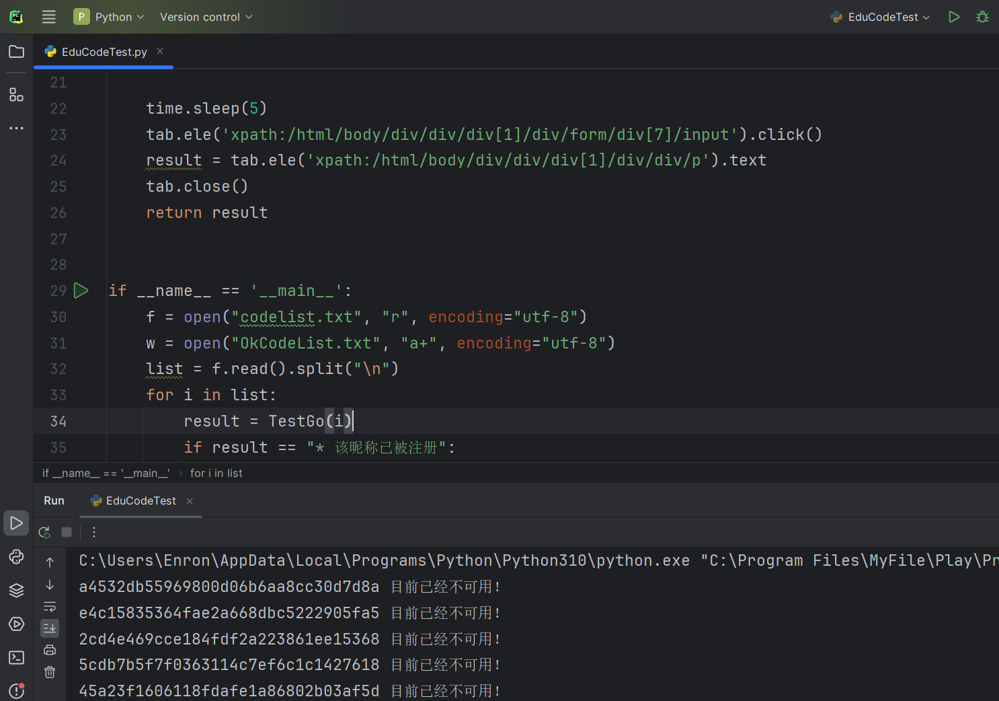

# EduCodeTest
EduSRC 教育漏洞报告平台 邀请码有效性测试

如果你是一名EduSRC老鸟，那么你手中也许会有成百上千的邀请码。
在校园里，经常遇到学妹向我们索要EduSRC的邀请码，她们也许注册之后就不会管了，但我们作为学长，不给确实不合适，但如果随意复制一个，还容易重复，因此开发此款工具，可以检索邀请码的有效性。

开发语言：Python

第三方模块：DrissionPage

## 使用方法
1. 首先确保装了第三方模块DrissionPage，没有的话可以通过pip install DrissionPage安装。
2. 将要测试的邀请码放入codelist.txt中
3. 直接运行即可，使用python EduCodeTest.py

   
   
6. 运行完毕后会自动将有效的验证码写入OkCodeList.txt中

## 注意事项
1. 代码随时可能会拉闸，这个原理就是根据注册时EduSRC错误的回显，来判断邀请码是否有效
2. 代码里的time.sleep是为了通过延时来规避edusrc的滑块验证。
